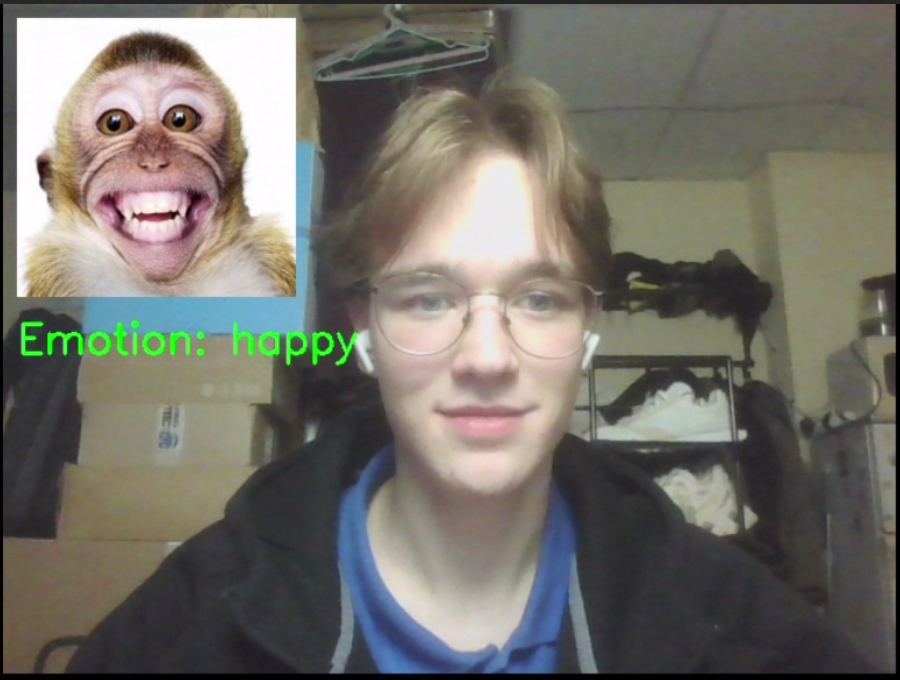
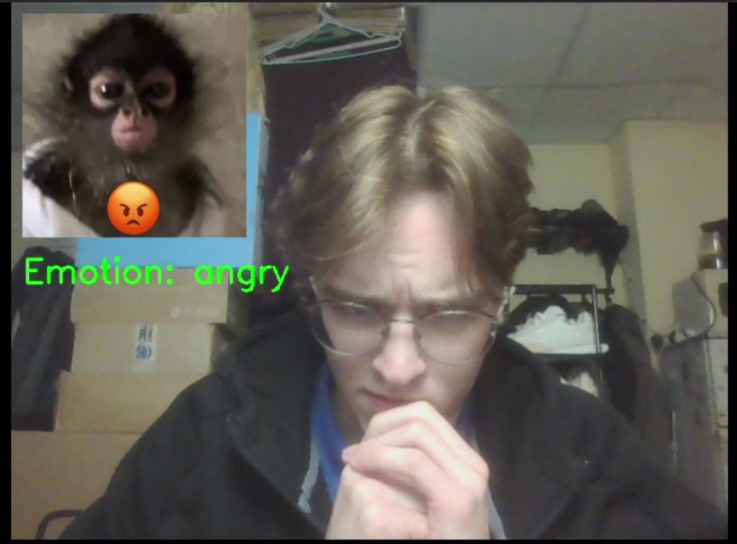
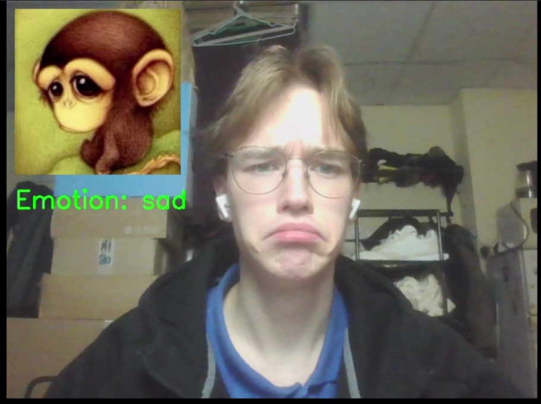
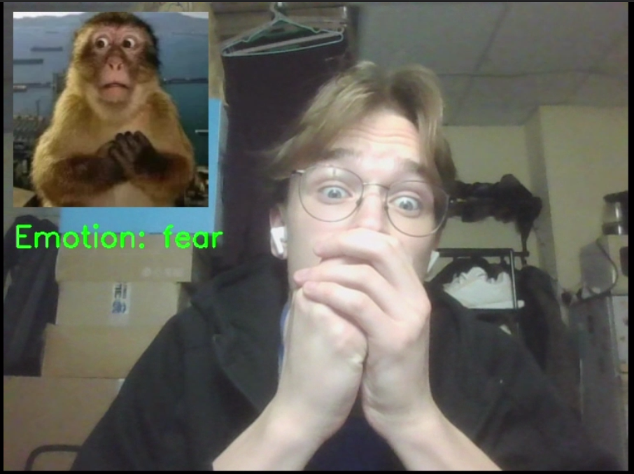
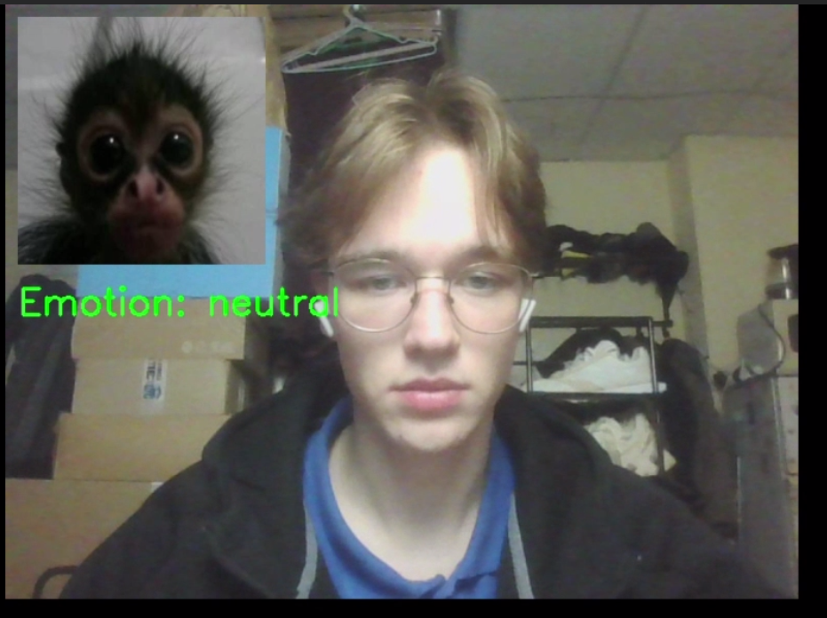

# 🐒 Monkey Emotion Mirror

Этот проект использует нейросеть для анализа эмоций человека в реальном времени и сопоставляет их с соответствующими изображениями обезьян, выражающими ту же эмоцию.

---

## Возможности

- Распознавание 7 базовых эмоций: `angry`, `disgust`, `fear`, `happy`, `sad`, `surprise`, `neutral`
- Отображение соответствующей картинки обезьянки в углу кадра
- Работа в реальном времени через веб-камеру

---

## Стек
- Python 3.12
- OpenCV
- DeepFace
- TensorFlow + tf-keras
- NumPy

---

## Примеры работы

| Эмоция | Скриншот |
|--------|----------|
| 😊 Happy |  |
| 😠 Angry |  |
| 😢 Sad |  |
| 😨 Fear |  |
| 😐 Neutral |  |# Monkey-Emotions
